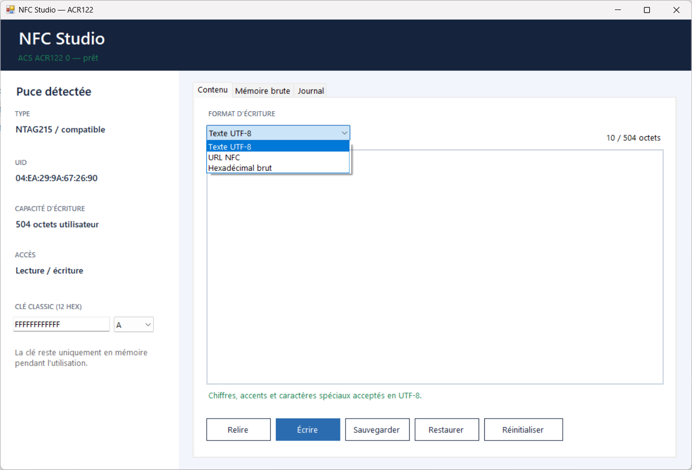

# NFC Studio

Application Windows pour lire, écrire, sauvegarder, restaurer et réinitialiser des puces NFC avec un lecteur **ACS ACR122 / ACR122U** utilisant l’interface PC/SC de Windows.

## Aperçu du logiciel



## Téléchargement

L’exécutable prêt à l’emploi se trouve dans [`release/NfcStudio.exe`](release/NfcStudio.exe).

1. Branchez le lecteur ACR122.
2. Lancez `NfcStudio.exe`.
3. Posez une seule puce au centre du lecteur.
4. Attendez l’affichage du type, de l’UID et de la capacité détectée.

Windows peut afficher « éditeur inconnu », car l’exécutable est compilé localement et n’est pas signé commercialement.

## Puces prises en charge

| Famille | Mémoire utilisateur gérée |
|---|---:|
| NTAG213 | 144 octets |
| NTAG215 | 504 octets |
| NTAG216 | 888 octets |
| MIFARE Classic 1K / Fudan compatible | 720 octets réservés à l’application |

Pour les NTAG21x, le modèle et la capacité sont détectés depuis la page de capacité de la puce. Le logiciel adapte automatiquement les pages lues, la limite d’écriture, la sauvegarde et la réinitialisation.

## Fonctions

- détection automatique du lecteur et du type de puce ;
- affichage de l’UID, de l’ATR et de la mémoire brute ;
- écriture de texte UTF-8, d’URL NFC NDEF ou de données hexadécimales ;
- prise en charge des messages NDEF longs sur NTAG215 et NTAG216 ;
- validation en temps réel avec compteur d’octets et alerte rouge ;
- authentification par clé A ou B pour MIFARE Classic/Fudan ;
- sauvegarde automatique avant écriture ;
- sauvegarde et restauration manuelles au format `.nfcbak` ;
- vérification après chaque écriture ;
- réinitialisation des données utilisateur sans toucher à l’UID, aux données fabricant, aux clés ou aux pages de sécurité.

## Sécurité

- NFC Studio ne contourne pas une clé MIFARE inconnue.
- Les bits NTAG verrouillés définitivement et les UID gravés en usine ne sont pas modifiables.
- Les pages fabricant, les sector trailers, les clés et les configurations de sécurité ne sont pas réinitialisés.
- Utilisez l’application uniquement avec vos propres cartes et systèmes.

## Compatibilité

La version actuelle cible **Windows** et dépend de :

- WinForms ;
- .NET Framework 4.x ;
- `winscard.dll` et du service PC/SC de Windows.

Elle n’est pas directement compatible avec Linux. Le lecteur ACR122 peut toutefois être utilisé sous Linux avec `pcsc-lite`, à condition de créer une interface multiplateforme dédiée.

## Compilation

Le projet tient dans un fichier C# sans dépendance NuGet. Depuis PowerShell sous Windows :

```powershell
.\build.ps1
```

L’exécutable est généré dans `dist/NfcStudio.exe`.

## Documentation

Consultez [`docs/Guide-NFC-Studio.txt`](docs/Guide-NFC-Studio.txt) pour le guide complet.

## Licence

Aucune licence open source n’est déclarée pour le moment. Tous droits réservés au propriétaire du dépôt.

